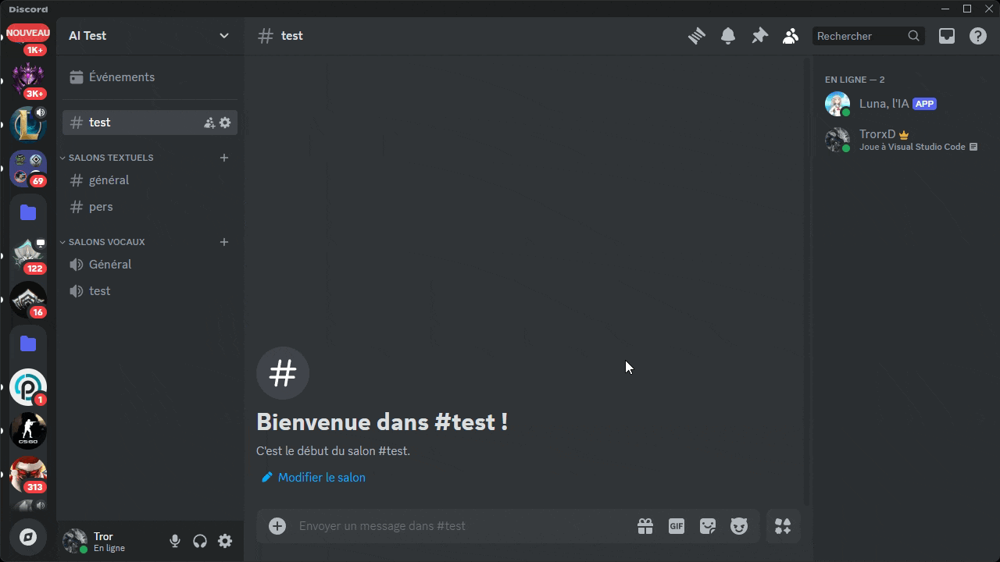
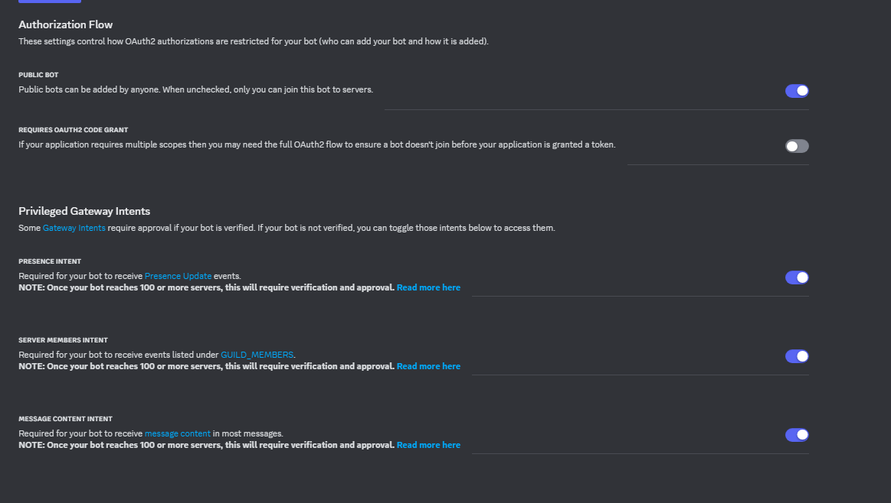
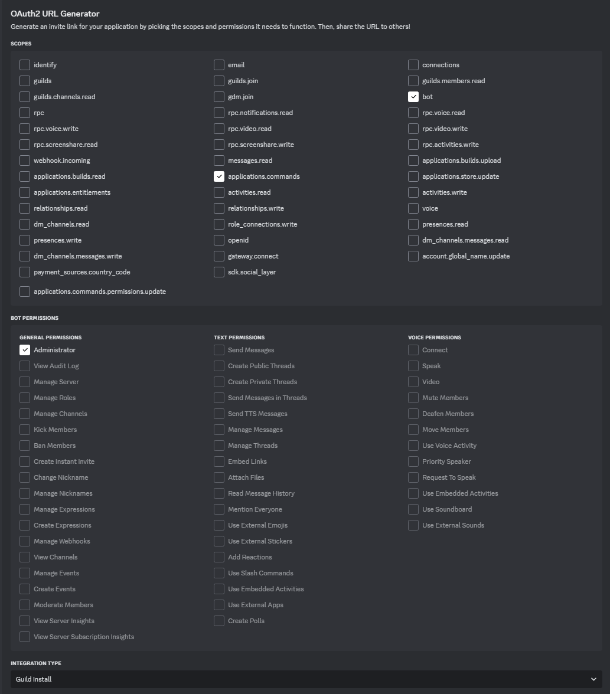

 
# AI_local_discord_assistant



## Description

This **AI Chatbot Discord Project** is a personnal project that consists of multiple Python files that will help you to create an AI discord assistant that runs locally on your computer using the ollama library. The goal was to share a way for my friends with little programming knowledge a way to create their own Discord AI assistant

I personally have a way more advanced AI assistant but it's not fully local and I only aim to give you a starting point. 

Made by Owen BRAUX in january 2025.


## Table of Contents

1. [Installation Prerequisites](#1---installation-prerequisites)
2. [Features](#2---Features)
3. [Installation](#3---installation)
4. [Ollama set up](#4---Ollama-set-up)
5. [Discord bot set up](#5---Discord-bot-set-up)
6. [Config](#6---Config)
7. [Run](#7---run)


## 1 - Installation Prerequisites

Before setting up the project, ensure you have the following tools and services:

### **Python**

Make sure you have **Python 3.11+** installed on your system. You can download Python from the official website :

- [Python Official Website](https://www.python.org/downloads/)

Here is a [tutorial](https://realpython.com/installing-python/) that I recommend if you struggle to install Python


#### To check if Python is already installed, open your terminal or command prompt and run:

```
python --version
```

- **[Ollama](https://ollama.com/)**: For running the Ollama model.
  - You can find the Python resources for Ollama [here](https://github.com/ollama/ollama-python).

- **[Git bash](https://git-scm.com/downloads)**: Used to clone the project from the GitHub repository.

### Additional Prerequisites for Audio Playback (needed to have audio anwers in a voice channel) :

- **FFmpeg**: Required for the Discord bot to play audio files.
  - Download FFmpeg from the official website: [FFmpeg Download](https://ffmpeg.org/download.html).
  - Alternatively, use this repository to get FFmpeg builds: [FFmpeg Builds](https://github.com/BtbN/FFmpeg-Builds/releases).
  - Ensure you place `ffmpeg.exe` in the folder of this build or you could set it up in your system's PATH environment variable.


## 2 - Features

1. **Answer to Users' Text Messages**

2. **Answer to Users' Voice Messages**

3. **Small memory with the History JSON File**

4. **LOCAL Text-to-Speech (TTS) Answer**

5. **Custom Prompt/Background for Better Performance**

6. **Voice Recognition for Different Users**


## 3 - Installation

### Cloning the Project

To clone the repository to your local machine, run the following command:

```
git clone https://github.com/Brauxo/AI_local_discord_assistant
```

You will also need the python libraries, run the following command:

```
pip install -r requirements.txt
```


## 4 - Ollama set up

After having downloading Ollama you still have to download a model. 

I personally use mistral but if you're computer is not power full you can use llama3.2 or something else.

7B parameters model (fast but requires a strong computer)
```
ollama run mistral
```

3B parameters model (fast)
```
ollama run llama3.2
```

1B parameters model (very fast)
```
ollama run llama3.2:1b
```


## 5 - Discord bot set up

Setting up a Discord bot involves creating a bot account on Discord, setting up necessary permissions, and integrating it with your code. Below is a step-by-step guide to help you set up your own Discord bot for this project.

### 1. **Create a Discord Bot Account**

To create a bot on Discord, follow these steps:

#### Step 1: Go to the Discord Developer Portal

- Visit the [Discord Developer Portal](https://discord.com/developers/applications).

#### Step 2: Create a New App

- Click on the **"New Application"** button.
- Enter a name for your application (this is your bot's name).
- Click **"Create"**.

#### Step 3: Create a Bot for your app

- In the left sidebar, navigate to the **"Bot"** section.
- Click on **"Add Bot"** to create a bot for your application.

#### Step 4: Set Up your Bot Token

- Under the **"Bot"** section, you will see a token labeled **"TOKEN"**.
- Click on **"Copy"** to copy the bot token. ⚠⚠⚠ **Do not share this token with anyone** as it provides access to control your bot.
- **Insert** the Token in the config file (see below)
- Also used all the settings present in the picture below.
<div align="center">
  
</div>

#### Step 5: Customize Your Bot (Optional)

- You can also change your bot's avatar, description, and other settings from the **"Bot"** section.


### 2. **Invite the Bot to Your Server**

Once your bot is created, you need to invite it to a Discord server.

#### Step 1: Generate the Bot's Invite Link

- In the **"OAuth2"** section, click on **"URL Generator"**.
- Under **"OAuth2 URL Generator"**, select the following:
<div align="center">
  
</div>

You will now have a way to invite the bot !


#### Step 2: Invite the Bot

- Copy the generated URL and paste it into your browser.
- Select the server where you want to invite the bot.
- Click **"Authorize"** to add the bot to your server.


## 6 - Config

The `config.py` file is used to store all the necessary configuration settings for your Discord bot. These settings allow you to adjust bot behaviors, link it to external services, and customize various parameters.

⚠⚠⚠ You need to setup our model name (Mistral by default)
```
MODEL_NAME = "Mistral"
```

Here are default pathfile where you store ffmpeg and the history
```
HISTORY_FILE = "chat_history.json"
FFMPEG_EXECUTABLE = "ffmpeg.exe"
```


⚠⚠⚠ If you want to change the bot Backgrounds/prompt you need to write a story in the **SYSTEM_PROMPT**
```
SYSTEM_PROMPT = "change to what you want"
```

⚠⚠⚠ DISCORD_TOKEN: The bot’s authentication token required to connect to Discord. You need to place your bot’s actual token here (you can get it from the Discord Developer Portal).

⚠ BOT_NAME: The name of your bot, which is used when the bot is mentioned in a message.

Example : 
```
user : "Hello BOT_NAME how are you? 

BOT_NAME : I am fine thanks !
```


## 7 - Run

To run the bot : 

Start Ollama in your command prompt with 
```
ollama start
```

run the file main.py in the correct folder 
```
run main.py
```

